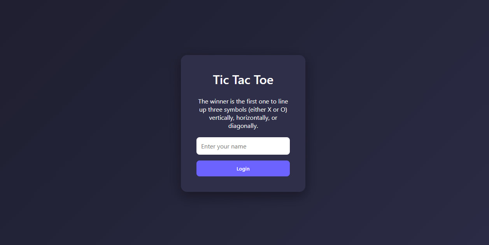
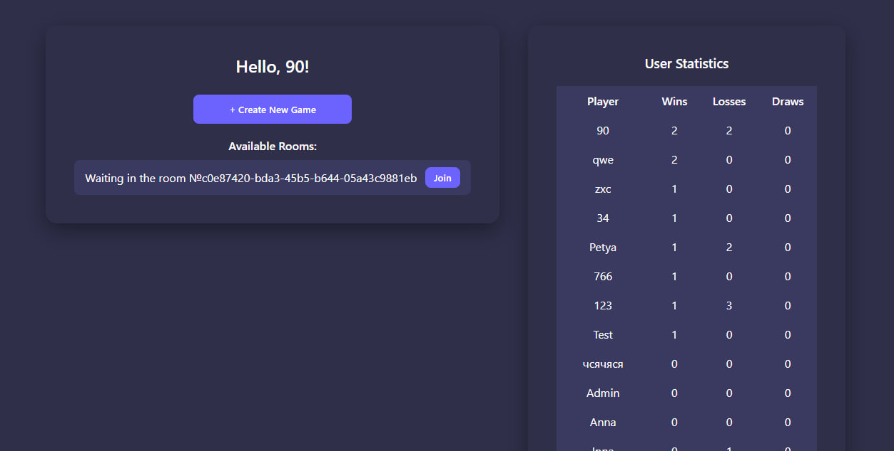
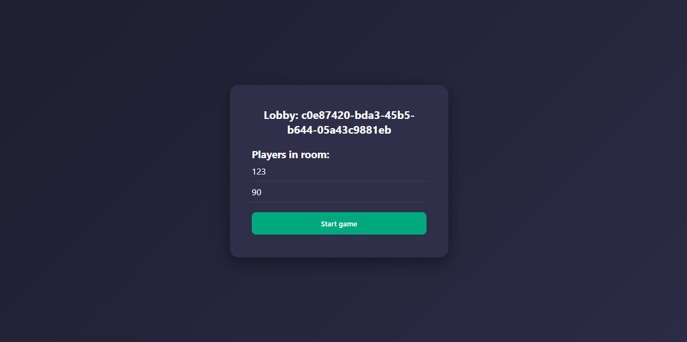
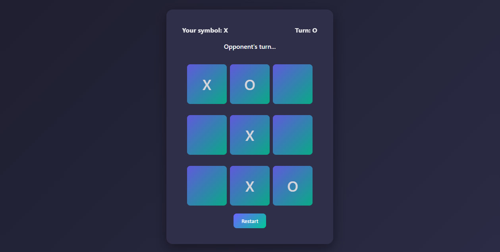
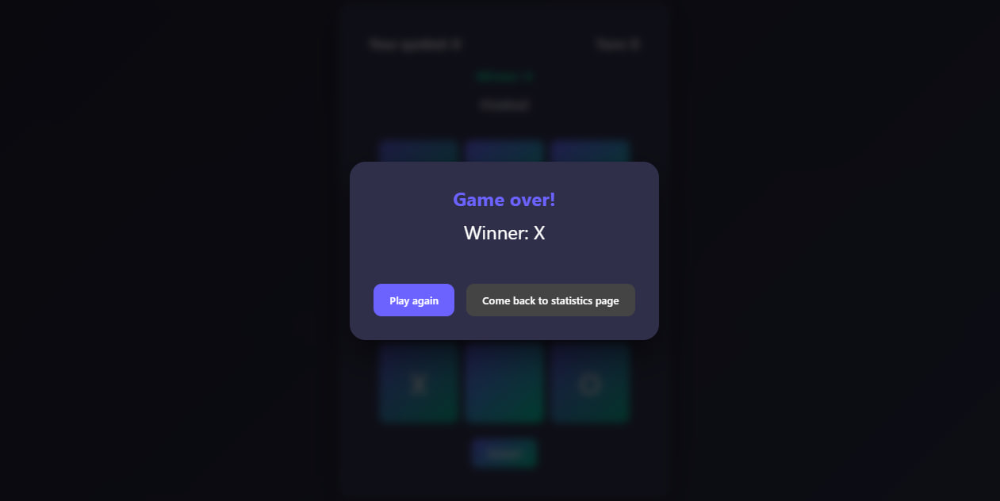

# Real-Time Tic-Tac-Toe (Itransition Task 6)

A real-time multiplayer Tic-Tac-Toe game built with WebSocket and PostgreSQL.

**Deploy:** [https://cozy-douhua-c88ba3.netlify.app/](https://cozy-douhua-c88ba3.netlify.app/)

## Tech Stack
- **Frontend:** React
- **Backend:** Node.js, Express, WebSocket (ws), PostgreSQL

##  Features
- Real-time gameplay via WebSocket
- Lobby with available rooms
- Create and join game sessions
- Turn-based logic
- Win, Loss, Draw tracking
- Persistent user statistics (PostgreSQL)

## Database Structure
```
CREATE TABLE tictactoe_users (
    id SERIAL PRIMARY KEY,
    username VARCHAR(255) UNIQUE NOT NULL,
    wins INTEGER DEFAULT 0,
    losses INTEGER DEFAULT 0,
    draws INTEGER DEFAULT 0,
    created_at TIMESTAMP DEFAULT NOW()
);
```

## Screenshots











